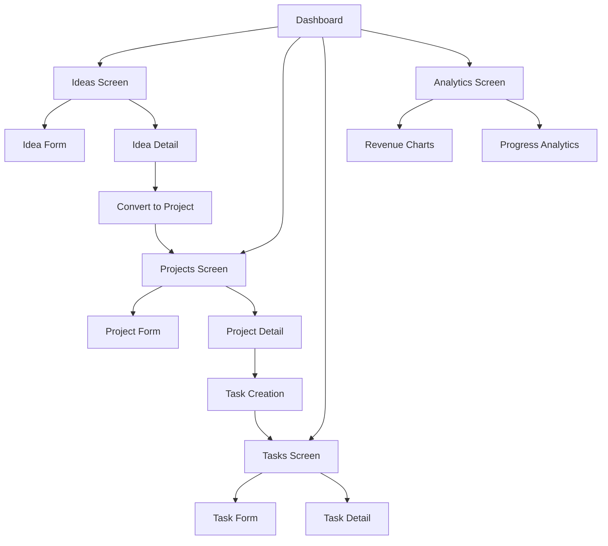

# BuildTrack - Product Requirements Document

## 1. Product Overview

BuildTrack is a comprehensive project management application designed specifically for indie hackers and solo entrepreneurs to transform ideas into successful projects. The app provides a complete workflow from initial idea capture and validation to project execution and revenue tracking.

The platform addresses the unique challenges faced by indie hackers: managing multiple ideas, validating concepts systematically, tracking project progress, and monitoring business metrics. BuildTrack serves as a centralized hub for the entire entrepreneurial journey, helping users stay organized and focused on building profitable ventures.

Target market: Independent developers, solo entrepreneurs, and small startup teams looking for a streamlined project management solution tailored to their specific needs.

## 2. Core Features

### 2.1 User Roles

BuildTrack is designed as a single-user application without role-based access control, focusing on individual indie hackers and solo entrepreneurs.

| Role | Registration Method | Core Permissions |
|------|---------------------|------------------|
| Solo User | Local app installation | Full access to all features including idea management, project creation, task tracking, and analytics |

### 2.2 Feature Module

Our BuildTrack application consists of the following main pages:

1. **Dashboard**: overview statistics, quick actions, recent activity feed
2. **Ideas Screen**: idea grid view, idea creation form, idea detail view with validation scoring
3. **Projects Screen**: project list view, project creation form, project detail with Kanban board
4. **Tasks Screen**: task list view, task creation form, task detail management
5. **Analytics Screen**: comprehensive metrics, charts, revenue tracking, progress analytics

### 2.3 Page Details

| Page Name | Module Name | Feature description |
|-----------|-------------|---------------------|
| Dashboard | Overview Statistics | Display total counts for ideas, projects, tasks, and monthly revenue with visual stat cards |
| Dashboard | Quick Actions | Provide rapid access to create new ideas, projects, tasks, and view analytics |
| Dashboard | Recent Activity | Show recent ideas, projects, and tasks with navigation to detail views |
| Ideas Screen | Ideas Grid | Display ideas in card format with priority, tags, validation scores, and status filters |
| Ideas Screen | Idea Form | Create and edit ideas with title, description, tags, priority, and validation metrics |
| Ideas Screen | Validation Scoring | Calculate idea scores based on market size, competition, and feasibility ratings |
| Ideas Screen | Idea Detail | View comprehensive idea information, attachments, notes, and convert to project |
| Projects Screen | Projects List | Display projects with progress bars, revenue metrics, due dates, and status filtering |
| Projects Screen | Project Form | Create and edit projects with title, description, revenue tracking, user counts, and due dates |
| Projects Screen | Project Detail | Kanban-style task board with drag-and-drop functionality and progress tracking |
| Projects Screen | Progress Calculation | Automatically update project progress based on completed tasks ratio |
| Tasks Screen | Tasks List | Display tasks with priority indicators, due dates, status, and project associations |
| Tasks Screen | Task Form | Create and edit tasks with descriptions, priorities, time estimates, and project linking |
| Tasks Screen | Task Management | Track task status changes, time logging, comments, and attachments |
| Analytics Screen | Revenue Analytics | Display monthly recurring revenue trends, user growth, and project performance |
| Analytics Screen | Progress Charts | Visualize completion rates, productivity metrics, and goal tracking |
| Analytics Screen | Performance Metrics | Show task completion rates, project success ratios, and time tracking analytics |

## 3. Core Process

### Main User Workflow

The primary user journey follows a structured approach from idea conception to project completion:

1. **Idea Capture**: User captures new business ideas with descriptions, tags, and initial thoughts
2. **Idea Validation**: User evaluates ideas using the built-in scoring system (market size, competition, feasibility)
3. **Project Creation**: Validated ideas are converted into active projects with goals and timelines
4. **Task Breakdown**: Projects are divided into manageable tasks with priorities and estimates
5. **Execution Tracking**: User manages tasks through different status stages and tracks progress
6. **Analytics Review**: User monitors project performance, revenue metrics, and overall productivity

## 4. User Interface Design

### 4.1 Design Style

- **Primary Colors**: Deep Blue (#1E3A8A) for main actions, Emerald Green (#10B981) for success states
- **Secondary Colors**: Amber (#F59E0B) for warnings and highlights, Purple for revenue metrics
- **Background**: Dark theme with Dark Gray (#111827) background and Lighter Gray (#1F2937) surfaces
- **Typography**: Inter font family for modern, clean readability with varied font weights
- **Button Style**: Rounded corners with elevation shadows, consistent padding and hover states
- **Layout Style**: Card-based design with grid layouts, bottom navigation, and floating action buttons
- **Icons**: Material Design icons with outlined and filled variants for active/inactive states

### 4.2 Page Design Overview

| Page Name | Module Name | UI Elements |
|-----------|-------------|-------------|
| Dashboard | Overview Statistics | 2x2 grid of stat cards with icons, values, and subtitles in primary colors |
| Dashboard | Quick Actions | Horizontal row of action buttons with icons and labels for rapid access |
| Dashboard | Recent Activity | Vertical list cards with titles, descriptions, and trailing status indicators |
| Ideas Screen | Ideas Grid | 2-column grid of idea cards with star ratings, tags, priority badges, and timestamps |
| Ideas Screen | Idea Form | Full-screen form with text fields, dropdown selectors, tag chips, and slider inputs |
| Ideas Screen | Validation Scoring | Progress bars for market size, competition, feasibility with color-coded scoring |
| Projects Screen | Projects List | Full-width cards with progress bars, revenue displays, due date badges, and status chips |
| Projects Screen | Project Detail | Kanban board with 4 columns (TODO, DOING, TEST, DONE) and draggable task cards |
| Tasks Screen | Tasks List | List view with priority icons, due date indicators, project tags, and status badges |
| Tasks Screen | Task Form | Form with text areas, date pickers, priority selectors, and time estimation inputs |
| Analytics Screen | Charts Section | Card-based chart containers with revenue line graphs and progress donut charts |
| Analytics Screen | Metrics Grid | 3-column grid of metric cards showing KPIs with trend indicators and percentages |

### 4.3 Responsiveness

BuildTrack is designed as a mobile-first application with adaptive layouts for larger screens. The app includes touch-optimized interactions, swipe gestures for navigation, and responsive grid systems that adjust column counts based on screen size. Bottom navigation provides consistent access to main sections across all device sizes.