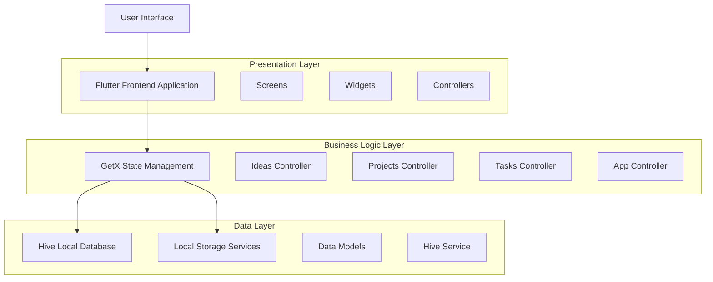
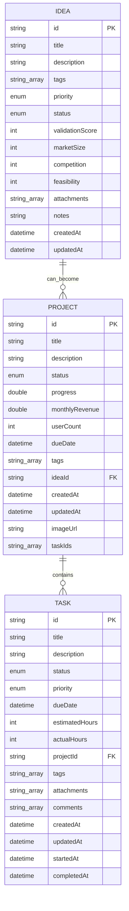
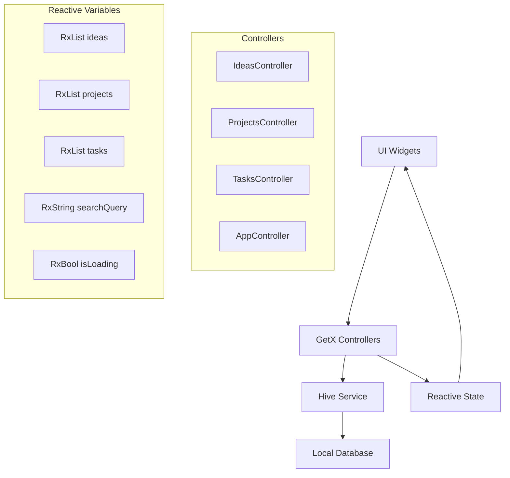

# BuildTrack - Technical Architecture Document

## 1. Architecture Design



## 2. Technology Description

* Frontend: Flutter\@3.8.1 + GetX\@4.6.6 + Material Design

* State Management: GetX for reactive state management and dependency injection

* Local Database: Hive\@2.2.3 for NoSQL local storage with type adapters

* UI Framework: Material Design with custom dark theme and Google Fonts

* Build Tools: build\_runner\@2.4.13 + hive\_generator\@2.0.1 for code generation

## 3. Route Definitions

| Route         | Purpose                                                     |
| ------------- | ----------------------------------------------------------- |
| /             | Main screen with bottom navigation and IndexedStack         |
| /dashboard    | Dashboard with overview statistics and quick actions        |
| /ideas        | Ideas management screen with grid view and filtering        |
| /projects     | Projects management screen with list view and Kanban boards |
| /tasks        | Tasks management screen with list view and status tracking  |
| /analytics    | Analytics screen with charts and performance metrics        |
| /idea-form    | Idea creation and editing form                              |
| /project-form | Project creation and editing form                           |
| /task-form    | Task creation and editing form                              |

## 4. Data Model

### 4.1 Data Model Definition



### 4.2 Data Definition Language

**Idea Model (Hive TypeId: 0)**

```dart
// Hive type adapters auto-generated
@HiveType(typeId: 0)
class Idea extends HiveObject {
  @HiveField(0) String id;
  @HiveField(1) String title;
  @HiveField(2) String description;
  @HiveField(3) List<String> tags;
  @HiveField(4) IdeaPriority priority;
  @HiveField(5) IdeaStatus status;
  @HiveField(6) int validationScore;
  @HiveField(7) int marketSize;
  @HiveField(8) int competition;
  @HiveField(9) int feasibility;
  @HiveField(10) List<String> attachments;
  @HiveField(11) String notes;
  @HiveField(12) DateTime createdAt;
  @HiveField(13) DateTime updatedAt;
}

@HiveType(typeId: 1)
enum IdeaPriority { low, medium, high }

@HiveType(typeId: 2)
enum IdeaStatus { backlog, validated, archived }
```

**Project Model (Hive TypeId: 3)**

```dart
@HiveType(typeId: 3)
class Project extends HiveObject {
  @HiveField(0) String id;
  @HiveField(1) String title;
  @HiveField(2) String description;
  @HiveField(3) ProjectStatus status;
  @HiveField(4) double progress;
  @HiveField(5) double monthlyRevenue;
  @HiveField(6) int userCount;
  @HiveField(7) DateTime? dueDate;
  @HiveField(8) List<String> tags;
  @HiveField(9) String? ideaId;
  @HiveField(10) DateTime createdAt;
  @HiveField(11) DateTime updatedAt;
  @HiveField(12) String? imageUrl;
  @HiveField(13) List<String> taskIds;
}

@HiveType(typeId: 4)
enum ProjectStatus { planning, active, completed, onHold, cancelled }
```

**Task Model (Hive TypeId: 5)**

```dart
@HiveType(typeId: 5)
class Task extends HiveObject {
  @HiveField(0) String id;
  @HiveField(1) String title;
  @HiveField(2) String description;
  @HiveField(3) TaskStatus status;
  @HiveField(4) TaskPriority priority;
  @HiveField(5) DateTime? dueDate;
  @HiveField(6) int estimatedHours;
  @HiveField(7) int actualHours;
  @HiveField(8) String projectId;
  @HiveField(9) List<String> tags;
  @HiveField(10) List<String> attachments;
  @HiveField(11) List<String> comments;
  @HiveField(12) DateTime createdAt;
  @HiveField(13) DateTime updatedAt;
  @HiveField(14) DateTime? startedAt;
  @HiveField(15) DateTime? completedAt;
}

@HiveType(typeId: 6)
enum TaskStatus { todo, inProgress, testing, done, blocked }

@HiveType(typeId: 7)
enum TaskPriority { low, medium, high, urgent }
```

**Hive Service Initialization**

```dart
// Initialize Hive boxes for local storage
class HiveService {
  static late Box<Idea> _ideasBox;
  static late Box<Project> _projectsBox;
  static late Box<Task> _tasksBox;
  
  static Future<void> init() async {
    await Hive.initFlutter();
    
    // Register adapters
    Hive.registerAdapter(IdeaAdapter());
    Hive.registerAdapter(IdeaPriorityAdapter());
    Hive.registerAdapter(IdeaStatusAdapter());
    Hive.registerAdapter(ProjectAdapter());
    Hive.registerAdapter(ProjectStatusAdapter());
    Hive.registerAdapter(TaskAdapter());
    Hive.registerAdapter(TaskStatusAdapter());
    Hive.registerAdapter(TaskPriorityAdapter());
    
    // Open boxes
    _ideasBox = await Hive.openBox<Idea>('ideas');
    _projectsBox = await Hive.openBox<Project>('projects');
    _tasksBox = await Hive.openBox<Task>('tasks');
  }
}
```

## 5. State Management Architecture



## 6. Key Technical Features

### 6.1 Local Data Persistence

* Hive NoSQL database for offline-first functionality

* Type-safe data models with code generation

* Automatic data serialization and deserialization

* Efficient querying and filtering capabilities

### 6.2 Reactive State Management

* GetX for dependency injection and state management

* Observable collections for real-time UI updates

* Automatic disposal of resources and memory management

* Simplified navigation and route management

### 6.3 Business Logic Features

* Automatic validation score calculation for ideas

* Dynamic project progress tracking based on task completion

* Revenue and user metrics tracking

* Advanced filtering and sorting capabilities

* Time tracking for task management

### 6.4 UI/UX Features

* Dark theme optimized for developer workflows

* Responsive grid layouts and card-based design

* Material Design components with custom styling

* Smooth animations and transitions

* Touch-optimized interactions for mobile devices

